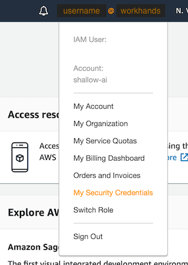
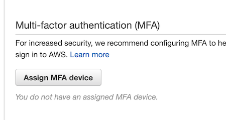

# AWS Set up

1. Visit https://workhands.signin.aws.amazon.com/console
2. Fill in the IAM User Name and Password with the credentials you were given.
2. Upon successful sign in, you should be prompted to change your password.
3. Click your user account name and go to My Security Credentials to begin
   setting up your MFA device for multi-factor authentication:

   

4. Before starting setup for MFA, make sure you have set up Google Authenticator
   or another app that handles virtual MFA. Currently there is an AWS bug that
   will prevent you from completing the MFA setup if you start the process,
   cancel out of it, and then try to restart it. If you do encounter this issue,
   please talk to Patrick or Jeanine about cleaning up the initial MFA attempt
   so you can try again.
5. Setup your MFA Access by clicking on “Assign MFA Device”. Follow the
   instructions to set up Google Authenticator, or another Virtual MFA Device.
   **For the MFA device name, be sure to enter your IAM username that you use to
   sign in to the AWS console or you will get a permissions error.**

   

6. Sign out and sign back in with your new password. Note that you will be
   prompted to enter a code from your MFA device.
7. Go to the S3 Service. You should be able to see a list of buckets, and you
   should have permission to access the `apprenticeshipstandards-staging` and
   `apprenticeshipstandards-prod` buckets. Note that if you do not set up an MFA
   device or if you set up an MFA device without using your username as the
   device name, then you will not see any buckets listed.

